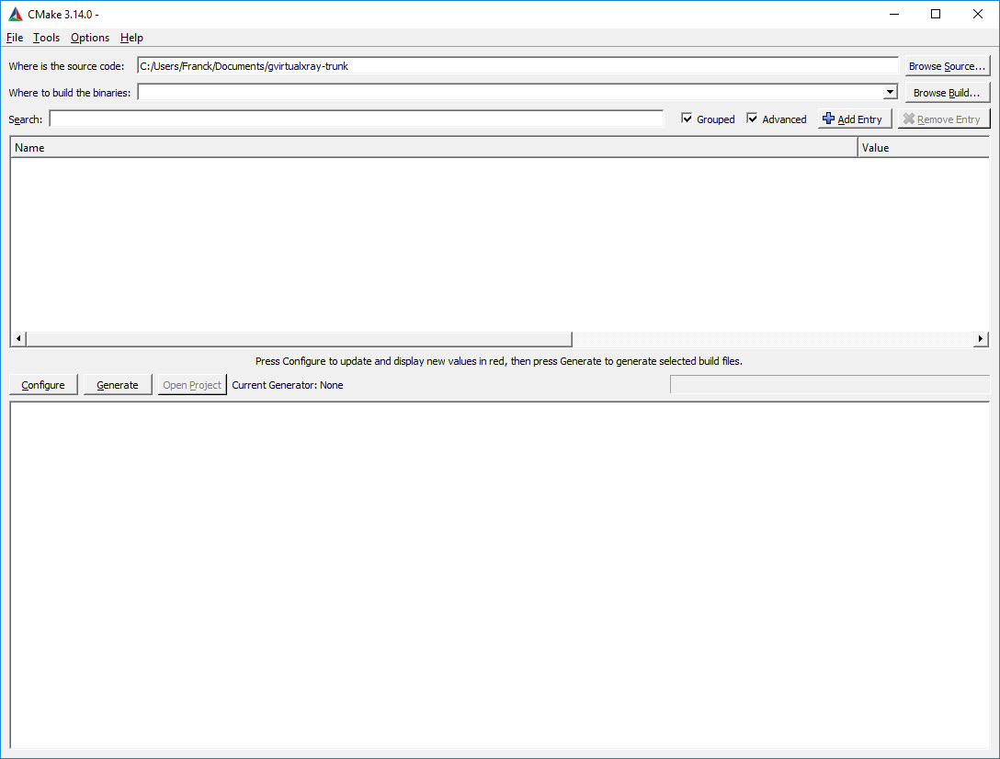
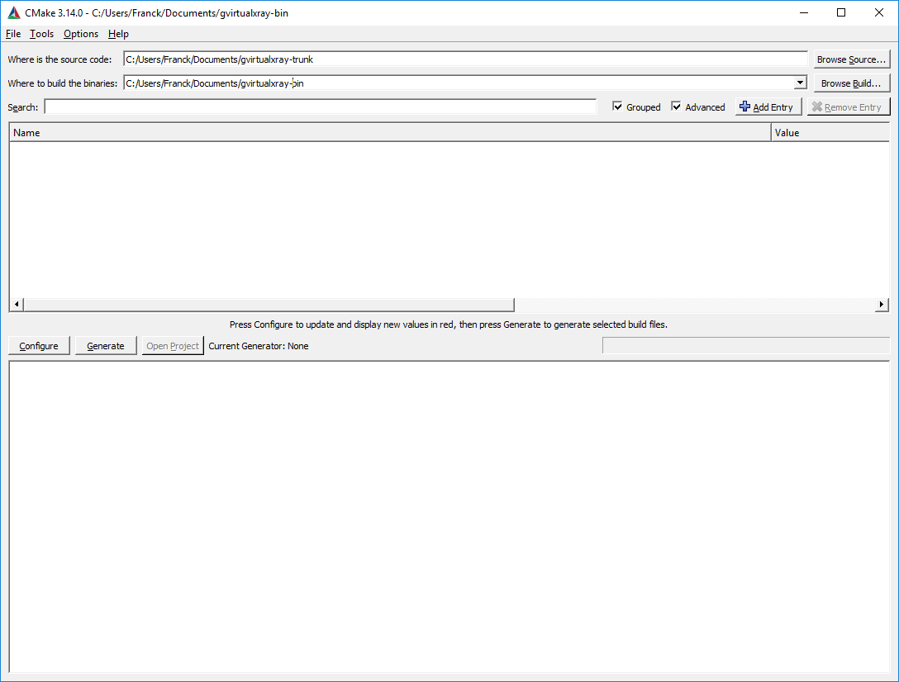
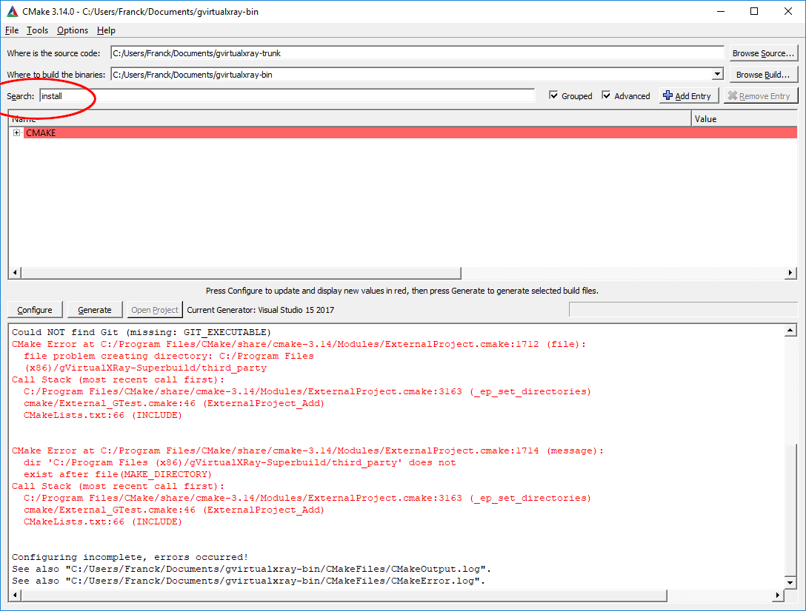
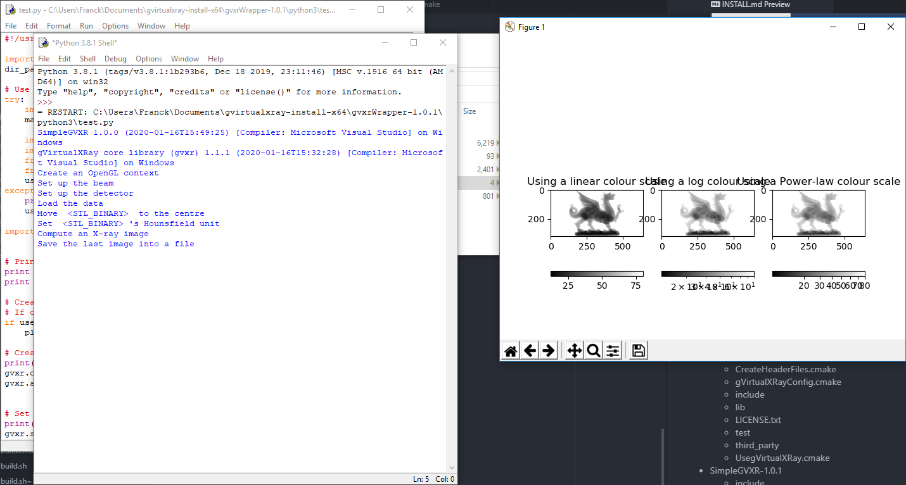
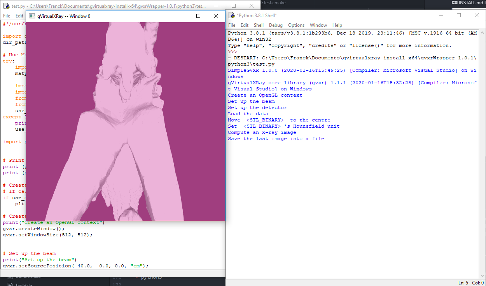
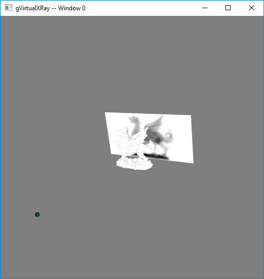
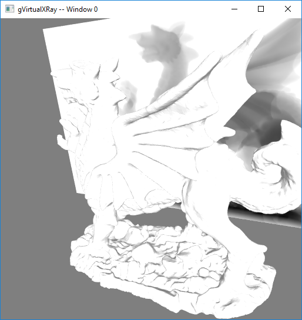
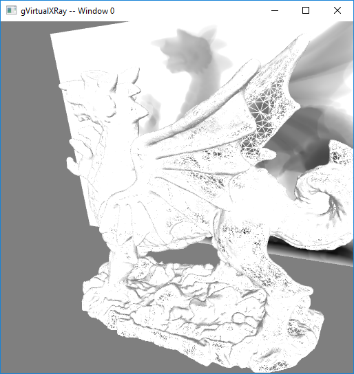

# How to compile and install gVirtualXRay Suite

## First steps

Make sure you have:

- CMake 3.12 or newer (see [http://www.cmake.org/](http://www.cmake.org/));
- A C++ compiler; and
- A GPU that supports OpenGL.

## Download the latest version of the source code

- The latest release [gVirtualXRay-1.1.1-Source.zip](https://sourceforge.net/projects/gvirtualxray/files/1.1/gVirtualXRay-1.1.1-Source.zip/download) is available at [https://sourceforge.net/projects/gvirtualxray/files/1.1/gVirtualXRay-1.1.1-Source.zip/download](https://sourceforge.net/projects/gvirtualxray/files/1.1/gVirtualXRay-1.1.1-Source.zip/download).
- The latest version from SVN at [https://svn.code.sf.net/p/gvirtualxray/code/trunk](https://svn.code.sf.net/p/gvirtualxray/code/trunk).

## For GNU/Linux and Mac OS X:

1. Using the prompt, go to the directory where you want to compile the project, e.g. your home directory.
```bash
$ cd ~
```
2. Download the latest release:
```bash
$ mkdir gvirtualxray-code
$ cd gvirtualxray-code
$ wget https://sourceforge.net/projects/gvirtualxray/files/1.1/gVirtualXRay-1.1.1-Source.zip/download
$ mv download gVirtualXRay-1.1.1-Source.zip
$ unzip gVirtualXRay-1.1.1-Source.zip
```
3. Create a directory where the binaries will be created and go in this directory. Note that it CANNOT be a sub-directory of the source directory chosen in the previous step.
```bash
$ mkdir ../gvirtualxray-bin
$ cd ../gvirtualxray-bin
```
4. Choose where the binaries should be installed, ideally a directory where you can write. If you can't, make sure you use `sudo make` rather than `make` in Steps 5, and 6.
In the example below, I install it in my home directory in `gvxr-install`.
```bash
$ export GVXR_INSTALL_DIR=$HOME/gvirtualxray-install
```
5. Configure the project using CMake. Use `cmake`, `ccmake` or `cmake-gui` depending on what you prefers.
  - `cmake`:
  ```bash
  $ cmake \
      -DCMAKE_BUILD_TYPE:STRING=Release \
      -DCMAKE_INSTALL_PREFIX:STRING=$GVXR_INSTALL_DIR \
      -DBUILD_WRAPPER_CSHARP:BOOL=ON \
      -DBUILD_WRAPPER_JAVA:BOOL=ON \
      -DBUILD_WRAPPER_OCTAVE:BOOL=ON \
      -DBUILD_WRAPPER_PERL:BOOL=ON \
      -DBUILD_WRAPPER_PYTHON3:BOOL=ON \
      -DBUILD_WRAPPER_R:BOOL=ON \
      -DBUILD_WRAPPER_RUBY:BOOL=ON \
      -DBUILD_WRAPPER_TCL:BOOL=ON \
      -S ../gvirtualxray-code \
      -B $PWD
  ```
  - `ccmake`:
  ```bash
  $ ccmake \
      -DCMAKE_BUILD_TYPE:STRING=Release \
      -DCMAKE_INSTALL_PREFIX:STRING=$GVXR_INSTALL_DIR \
      -S ../gvirtualxray-code \
      -B $PWD
  ```
  - `cmake-gui`:
  ```bash
  $ ccmake \
      -DCMAKE_BUILD_TYPE:STRING=Release \
      -DCMAKE_INSTALL_PREFIX:STRING=$GVXR_INSTALL_DIR \
      -S ../gvirtualxray-code \
      -B $PWD
  ```
6. Compile the project
```bash
$ make -j8
```
I used a parallel build with 8 jobs as I got 8 cores in my CPU. Adjust `-j` depending on your computer. Once the project is made, it is also installed.


## For Windows

You may skip some of the initial steps depending on the current state of your system. I recommand to use 64 bits for all the components, including Python 3.

1. Download and install a compiler if needed. I recommend Microsoft's Visual Studio C++ from [https://visualstudio.microsoft.com/vs/](https://visualstudio.microsoft.com/vs/).
2. Download and install CMake from [https://cmake.org/download/](https://cmake.org/download/).
3. Download and install Python3 from [https://www.python.org/downloads/](https://www.python.org/downloads/).
4. Download and extract gVirtualXRay's code from [https://sourceforge.net/projects/gvirtualxray/files/1.1/gVirtualXRay-1.1.1-Source.zip/download](https://sourceforge.net/projects/gvirtualxray/files/1.1/gVirtualXRay-1.1.1-Source.zip/download).
5. Open CMake's gui.


6. Select where the source code is. This is the top directory of the repository that contains CMakeLists.txt.



7. Select where the binaries are going to be compiled. It CANNOT be a sub-directory of the source directory chosen in the previous step.



8. Press configure, then choose which compiler you want to use and which architecture. I used Visual Studio 15 2017's native compilers, and x64 (for 64 bits).


9. Click on `Configure`. There'll be an error, but don't worry about it.


10. Search for `install`.



11. Change the variable `CMAKE_INSTALL_PREFIX` into a path where you are allowed to write. Click on configure. If it does not work, change the path and make sure you have write privilege for that path.


12. If you want to build a wrapper, e.g. for Python 3, go to `BUILD` and tick the right option(s) (in my case `BUILD_PYTHON£_WRAPPER`). Now you can click on `Configure`, then `Generate`, then `Open Project`.


13. It will open Visual Studio. Change Debug into Release.


14. Do a right click on `BUILD_ALL` or press the `F7` key to build the project.


15. Go and make some coffee, it's gonna take a bit of time...
At the end, in the output, you should see something like
```
========== Build: 4 succeeded, ...
```


## After the compilation

### Installation directory content in Windows

On Windows, you Should see 4 or 5 directories in the installation directory depending on wrappers:

- bin
- third_party
  - include
  - lib (Windows) or lib64 (GNU/Linux and Mac OS X???)
- gVirtualXRay-1.1.1
  - Bin2C.cmake
  - CreateHeaderFiles.cmake
  - gVirtualXRayConfig.cmake
  - include
  - lib
  - LICENSE.txt
  - test
  - third_party
  - UsegVirtualXRay.cmake
- SimpleGVXR-1.0.1
  - include
  - lib
  - SimpleGVXR-doc.i
  - SimpleGVXRConfig.cmake
  - test
  - UseSimpleGVXR.cmake
- gvxrWrapper-1.0.1
  - data
  - python3

### Installation directory content in GNU/Linux and Mac OS X

On Unixes, you Should see 3 or 4 directories in the installation directory depending on wrappers:

- third_party
  - include
  - lib (Windows and Mac OS X) or lib64 (GNU/Linux)
- gVirtualXRay-1.1.1
  - Bin2C.cmake
  - CreateHeaderFiles.cmake
  - gVirtualXRayConfig.cmake
  - include
  - lib
  - LICENSE.txt
  - test
  - third_party
  - UsegVirtualXRay.cmake
- SimpleGVXR-1.0.1
  - include
  - lib
  - SimpleGVXR-doc.i
  - SimpleGVXRConfig.cmake
  - test
  - UseSimpleGVXR.cmake
- gvxrWrapper-1.0.1
  - data
  - python3

### Test the Python wrapper

1.  Go to `gvxrWrapper-1.0.1/python3`,
2. Execute the test script. You should see something like:


The X-ray image is displayed using linear, log and power law colour scales using Matplotlib.

3. Press <Q> to close this window and the real-time viewer will open:



4. Use the mouse wheel to zoom-out:


5. Use the mouse left button and move the mouse around to adjust the view:


6. Press <B> to hide/show the X-ray beam:



7. Press <W> to view the 3-D object in solid/wireframe mode:



8. You can also press <N> to display the X-ray image in negative or positive and <H> to hide/show the X-ray detector.
9. Press <Q> or <ESC> to exit. When the script ends, there'll be two new files:

- `xray_image-0.mha`: contains the X-ray image. MHA fies can be viewed with the popular scientific image viewer tool [ImageJ/Fiji](https://imagej.net/Fiji/).
- `lbuffer-0.mha`: contains the length of X-rays crossed in the 3-D object.
10. If you want to create your own simulations, have a look at the script. You can find it at [https://sourceforge.net/p/gvirtualxray/code/HEAD/tree/trunk/Wrappers/python3/test.py](https://sourceforge.net/p/gvirtualxray/code/HEAD/tree/trunk/Wrappers/python3/test.py).
